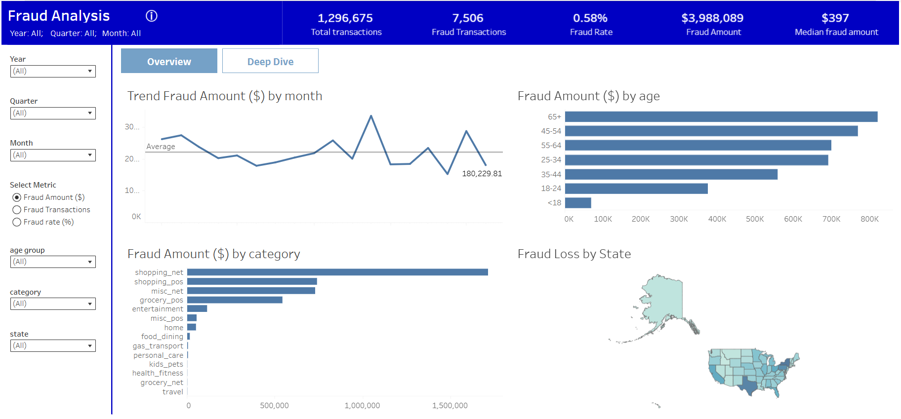
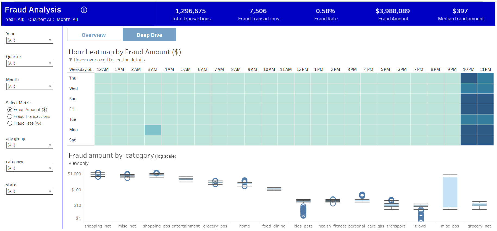

# Fraud Analysis Dashboard

## 📌 Project Overview

This project presents an interactive fraud analysis dashboard built in Tableau.  
The goal of the analysis was to explore fraudulent transaction patterns, identify the main sources of fraud losses, and provide a clear overview of fraud risk across customer segments, transaction categories, time periods, and U.S. states.

The dashboard allows users to monitor key fraud metrics, compare fraud trends over time, and investigate high-risk segments in more detail.

## 🔍 Key Questions

- What is the overall fraud rate and total fraud loss?
- Which transaction categories contribute the most to fraud amount?
- Which age groups are associated with the highest fraud losses?
- How does fraud amount change over time?
- Are there specific hours or weekdays with higher fraud activity?
- Which U.S. states show higher fraud losses?
- How do fraud patterns differ across categories, age groups, and time periods?

## 📊 Dashboard Structure

The Tableau project consists of two main dashboard pages:

### 1. Overview

The Overview page provides a high-level summary of fraud performance and includes:

- Total transactions
- Fraud transactions
- Fraud rate
- Total fraud amount
- Median fraud amount
- Fraud amount trend by month
- Fraud amount by age group
- Fraud amount by transaction category
- Fraud loss by state

This page is designed to quickly identify the largest fraud contributors and understand the general scale of the problem.

### 2. Deep Dive

The Deep Dive page focuses on more detailed fraud patterns and includes:

- Hourly fraud heatmap by weekday
- Fraud amount by category on a logarithmic scale
- Interactive filters for year, quarter, month, age group, category, and state

This page helps investigate when fraud is more concentrated and whether specific categories show unusual fraud distributions or outliers.

## 🧠 Key Insights

- The overall fraud rate is relatively low at around **0.58%**, but the total fraud amount is substantial.
- Fraud losses are concentrated in several transaction categories, especially online shopping and miscellaneous categories.
- Older age groups, particularly **65+**, show the highest total fraud amount.
- Fraud activity appears to be stronger during late evening hours, especially around **10 PM and 11 PM**.
- The median fraud amount was used alongside total fraud amount to reduce the impact of extreme values and better understand typical fraud transaction size.
- The state-level map helps identify geographic concentration of fraud losses across the U.S.

## 🛠 Tools Used

- Tableau
- Excel / CSV data preparation

## 📈 Metrics Used

- Total Transactions
- Fraud Transactions
- Fraud Rate
- Fraud Amount
- Median Fraud Amount
- Fraud Amount by Month
- Fraud Amount by Age Group
- Fraud Amount by Category
- Fraud Loss by State

## 🔗 Project Links

Tableau dashboard: [View project](https://public.tableau.com/app/profile/kateryna.hurevych/viz/fraud_analisys_tableau_dashboard/Overview)

## 📎 Notes

This project was created as a portfolio analytics project to demonstrate dashboard design, fraud metric analysis, interactive filtering, and the ability to communicate business insights through data visualization.